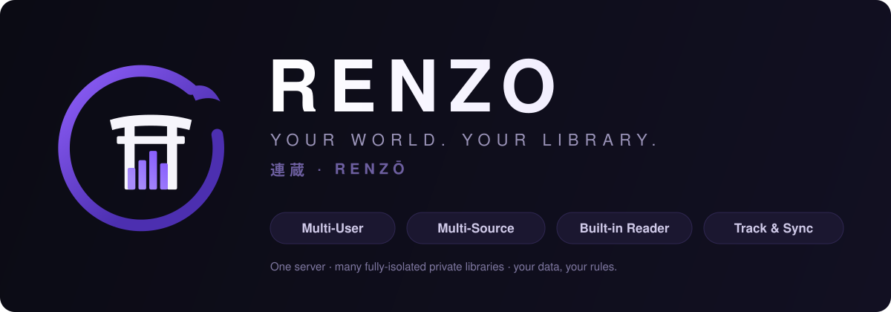

<p align="center">
  
</p>

<h1 align="center">連蔵 · Renzō</h1>
<p align="center"><em>Your world. Your library.</em></p>

**Renzō** is a self-hosted, multi-user manga / manhwa / manhua library and download manager. Subscribe to a series once and Renzō keeps it — across every source you configure — downloaded, organized, and up to date, in a *drop-and-forget* fashion. One server hosts many fully-isolated private libraries: every user gets their own library, downloads, sources, updates feed, reading progress, and account settings.

> Renzō is a rebrand and continuation of a fork of [maxpiva/Rensaio](https://github.com/maxpiva/Rensaio) (itself a fork of **Kaizoku / Kaizoku Next Gen** by OAE). Huge thanks to the upstream authors — this project stands on their work.

> [!IMPORTANT]
> **Back up your `/config` directory (including the database) before upgrading.** Upgrades are automatic on restart, but the devil never rests.

---

## ✨ Highlights

- 👥 **True multi-user** — Isolated libraries per user with permission levels (User / Manager / Admin / Owner). Optional authentication, invites, and an Owner "global view" for support. Each user gets a personal **Account** page for their own sensitive settings (per-site logins for coin/paid sources, external tracker links) — kept separate from the Owner-only app-wide `/settings`.
- 🔎 **Multi-source & multi-linking** — Link one series to many sources via **Mihon extensions**. Temporary vs. permanent sources: temporary sources only fill gaps and are auto-replaced when a permanent source provides the chapter.
- 📥 **Automatic downloads** — Retries, reschedules, a dedicated downloads page. Extensions auto-update.
- 🗂️ **Automatic categorization** — Series are auto-filed into **Manga / Manhwa / Manhua / Comic** by country-of-origin. When you link a series to a scrobbler (MAL/AniList/Kitsu), Renzō uses that ID-based `media_type` as the authoritative signal — far more accurate than a title guess.
- 🔗 **Built-in tracker sync (container-hosted OAuth)** — Connect **AniList · MyAnimeList · Kitsu · MangaDex** per user. The OAuth service is **bundled inside the container** — no reliance on any external hosted proxy. See [Tracker / OAuth setup](#-tracker--oauth-setup).
- 📖 **Built-in reader + read-state tracking** — Resume where you left off on any device; progress is stored with the series (and syncs over OPDS).
- 📡 **OPDS server** — Read from any OPDS app; per-user private path. `https://renzo.example.com/door-pebble`
- 🤖 **MCP server** — Expose your library to AI tools via the Model Context Protocol (append `/mcp` to your OPDS path), respecting user permissions.
- 🩺 **Status & health dashboard** — Color-coded alerts for broken providers, stale series, and more.
- 🧾 **Rich metadata** — `ComicInfo.xml` injection, per-series `cover.jpg`, and a `renzo.json` metadata/read-state map stored alongside your series.
- 🖼️ **Format support** — jxl, jp2, avif with real-time transcoding for clients that can't render them.
- 🌐 **Reverse-proxy friendly** — External-domain support; invite / password links resolve their base URL by priority: **1)** `External Domain` setting → **2)** first public-looking `Allowed Origins` entry → **3)** first private/LAN IP → **4)** `localhost`.

---

## 📚 Sources

Renzō connects to sources through **Mihon (Tachiyomi) extensions** — MangaDex, Kiryuu, ComicK, ReadComicsOnline, and many more, plus site-specific paid/locked-chapter handling for supported scanlator sites. Add, pin, and manage extensions from the **Sources** page.

---

## 🖥️ Platforms

| | Platform | Notes |
|---|----------|-------|
| 🪟 | **Renzo.exe** | Windows tray app (Avalonia) — see [Releases](https://github.com/Levitate0/Renzo/releases) |
| 🌐 | **Renzo.web** | The web UI — dark & light themes, responsive, PWA-friendly |
| 🤖 | **Renzo.apk** | Android build |

---

## 🐳 Docker

Available for `amd64` and `arm64`. **Host networking** is recommended for parallel downloads/searches.

### Volumes & ports

| Path / Port | Description |
|-------------|-------------|
| `/config` | Application config + database |
| `/series` | Downloaded series |
| `9833` | Web UI |

### Permissions

| Var | Default | Description |
|-----|---------|-------------|
| `PUID` | `99` | Host user ID |
| `PGID` | `100` | Host group ID |
| `UMASK` | `022` | File permission mask |

Ensure `PUID`/`PGID` have write access to `/config` and `/series`.

### docker-compose

```yaml
services:
  renzo:
    container_name: renzo
    image: 'renzo:latest'        # build locally (see "Build it yourself") or use your registry
    network_mode: host
    volumes:
      - '/path/to/your/series:/series'
      - '/path/to/your/config:/config'
    environment:
      - PUID=99
      - PGID=100
      - UMASK=022
      # --- Tracker / OAuth (optional; needed for MAL/AniList/etc. linking) ---
      - PROXY_MYANIMELIST_CLIENT_ID=your_mal_client_id
      - PROXY_MYANIMELIST_CLIENT_SECRET=your_mal_client_secret
      - PROXY_ANILIST_CLIENT_ID=your_anilist_client_id
      - PROXY_ANILIST_CLIENT_SECRET=your_anilist_client_secret
    ports:
      - '9833:9833'
```

---

## 🔗 Tracker / OAuth setup

Renzō hosts its **own** OAuth service inside the container (on loopback `127.0.0.1:5050`, fronted by the backend at `/api/oauth`). There is **no external auth server** to depend on or maintain. To enable per-user tracker linking:

1. **Register an API application** with each provider you want:
   - MyAnimeList → <https://myanimelist.net/apidocs> (create a Client ID)
   - AniList → *Settings → Developer → Create New Client*
2. **Set the redirect URI** in that provider app to:
   ```
   https://<your-renzo-domain>/api/oauth/<provider>/callback
   ```
   e.g. `https://renzo.example.com/api/oauth/myanimelist/callback`
3. **Provide the credentials** to the container via env vars (see compose above):
   `PROXY_MYANIMELIST_CLIENT_ID` / `PROXY_MYANIMELIST_CLIENT_SECRET`, `PROXY_ANILIST_CLIENT_ID` / `PROXY_ANILIST_CLIENT_SECRET`, and likewise `PROXY_KITSU_*` / `PROXY_MANGADEX_*`.
4. Each user then links their own account from **Account → Trackers**.

> The provider redirect URI must exactly match your public Renzō domain, and that domain must reach the container's port `9833`.

---

## 🧱 Build it yourself

```powershell
.\build_frontend.ps1   # builds the Next.js UI → wwwroot.zip
.\build_docker.ps1     # publishes the backend (+ bundled OAuth proxy) and builds a multi-arch image
.\build_apps.ps1       # publishes backend + tray app for win/linux/osx
```

The backend serves the pre-built frontend from `wwwroot`. The Docker image also bundles the OAuth proxy under `/app/oauthproxy`, started automatically by the entrypoint.

---

## 🛠️ Under the hood

- **Frontend** — Next.js (static export), dark/light themed, forked from Kaizoku Next by OAE.
- **Backend** — A .NET engine handling schedules, downloads, metadata, OPDS/MCP, and tracker sync, with a **Mihon bridge** (IKVM + a Java 8 Android compatibility layer derived from [Suwayomi](https://github.com/Suwayomi/Suwayomi-Server)) that runs Android Mihon extensions on .NET.
- **OAuth proxy** — A small ASP.NET service bundled in the container that performs the provider OAuth handshake with your own client credentials.

---

## ⚠️ Resource usage

Renzō can be memory-intensive with large libraries or heavy parallel search/download. Plan headroom accordingly.

---

## 🤝 Contributing

PRs welcome — especially frontend polish and backend stability/architecture. If you hit issues, check the `logs` folder and attach the relevant logs.

---

<p align="center"><sub>連蔵 · Renzō — a fork of <a href="https://github.com/maxpiva/Rensaio">maxpiva/Rensaio</a> · Kaizoku lineage by OAE.</sub></p>
